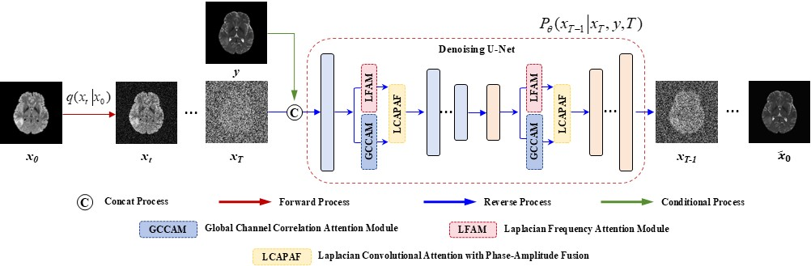

# GL2T-Diff: Medical Image Translation via Spatial-Frequency Fusion Diffusion Models

We propose a diffusion model (GL2T-Diff) based on convolutional channel and Laplacian frequency attention mechanisms, which is designed to enhance MIT tasks by effectively preserving critical image features.

<p align="center">
  
</p>

## Requirements
* Python==3.10.6
* torch==1.12.1
* torchvision==0.15.2
* numpy
* opencv-python
* tqdm
* tensorboard
* tensorboardX
* scikit-image
* medpy
* pillow
* scipy
* `pip install -r requirements.txt`

## Publicly available Dataset
- BraTS 2020/2024 dataset
- IXI – Information eXtraction from Images (EPSRC GR/S21533/02)
- Pelvic Dataset

## Usage
### 1. Git clone or download the codes.

### 2. Prepare data
* Please download our processed dataset or download from the official websites.
* After downloading, extract the file and put it into folder "data/". The directory structure should be as follows:

```bash
├── configs
│
├── data
│	├── BraTS
│	├── IXI
│	└── pelivc
│
├── datasets
│
├── functions
│
├── models
│
└── runners

```


### 3. Training/Sampling a GL2T-Diff model
* Please make sure that the hyperparameters such as scheduler type and timesteps are consistent between training and sampling.
* The total number of time steps is defaulted as 1000 in the paper, so the number of involved time steps should be less than 1000 as an integer.
```
python main.py --config {DATASET}.yml --dataset {DATASET_NAME} --exp {PROJECT_PATH} --doc {MODEL_NAME} --scheduler_type {SAMPLING STRATEGY} --timesteps {STEPS}
```
```
python main.py --config {DATASET}.yml --dataset {DATASET_NAME} --exp {PROJECT_PATH} --doc {MODEL_NAME} --sample --fid --scheduler_type {SAMPLING STRATEGY} --timesteps {STEPS}
```

where 
- `SAMPLING STRATEGY` controls the scheduler sampling strategy proposed in the paper (either uniform or non-uniform).
- `STEPS` controls how many timesteps used in the training and inference process. It should be an integer less than 1000 for Fast-DDPM.


### 4. Training/Sampling a DDPM model
* Please make sure that the hyperparameters such as scheduler type and timesteps are consistent between training and sampling.
* The total number of time steps is defaulted as 1000 in the paper, so the number of time steps for DDPM is defaulted as 1000.
```
python ddpm_main.py --config {DATASET}.yml --dataset {DATASET_NAME} --exp {PROJECT_PATH} --doc {MODEL_NAME} --timesteps {STEPS}
python ddpm_main.py --config brats_linear.yml --dataset BRATS --doc T1_to_T2_lap --timesteps 1000
```
```
python ddpm_main.py --config {DATASET}.yml --dataset {DATASET_NAME} --exp {PROJECT_PATH} --doc {MODEL_NAME} --sample --fid --timesteps {STEPS}
```
python ddpm_main.py --config brats_linear.yml --dataset BRATS  --doc BraTS2024/T1_flairBraTS2024 --sample --fid --timesteps 100

where 
- `DATASET_NAME` should be selected among `LDFDCT` for image denoising task, `BRATS` for image-to-image translation task.
- `STEPS` controls how many timesteps used in the training and inference process. It should be 1000 in the setting of this paper.


## References
* The code is mainly adapted from [DDIM](https://github.com/ermongroup/ddim).
      year={2024},
      eprint={2405.14802},
      archivePrefix={arXiv},
      primaryClass={eess.IV}
}
```
